# Polyglot Codebase Knowledge Graph

> Generated offline by **readmenator**. Supports C, C++, Python, Go, Rust, JS/TS, Java, C#, Shell, PHP, Dart, GDScript, Nim, ASM.
> No LLMs. No tokens. Pure static analysis. See more [here](https://github.com/grisuno/ReadMenator)

**Total Files Parsed:** 3 | **Total Symbols Extracted:** 17 | **Total Imports:** 21

## Structural Knowledge Map

```mermaid
graph TD
    classDef mod fill:#1e1e1e,stroke:#ff6666,stroke-width:2px,color:#fff;
    classDef cls fill:#2d2d2d,stroke:#4ec9b0,stroke-width:2px,color:#fff;
    classDef fn fill:#333,stroke:#dcdcaa,stroke-width:1px,color:#dcdcaa;
    classDef ext fill:#111,stroke:#666,stroke-dasharray:5 5,color:#aaa;
    cli_py["cli.py (py)"]
    class cli_py mod;
    cli_py_signal_handler["signal_handler"]
    class cli_py_signal_handler fn;
    cli_py --> cli_py_signal_handler
    cli_py_show_help["show_help"]
    class cli_py_show_help fn;
    cli_py --> cli_py_show_help
    cli_py_check_api_key["check_api_key"]
    class cli_py_check_api_key fn;
    cli_py --> cli_py_check_api_key
    cli_py_configure_logging["configure_logging"]
    class cli_py_configure_logging fn;
    cli_py --> cli_py_configure_logging
    cli_py_parse_args["parse_args"]
    class cli_py_parse_args fn;
    cli_py --> cli_py_parse_args
    script_animator_py["script_animator.py (py)"]
    class script_animator_py mod;
    script_animator_py_add_text_to_image["add_text_to_image"]
    class script_animator_py_add_text_to_image fn;
    script_animator_py --> script_animator_py_add_text_to_image
    script_animator_py_generate_frames["generate_frames"]
    class script_animator_py_generate_frames fn;
    script_animator_py --> script_animator_py_generate_frames
    script_animator_py_main["main"]
    class script_animator_py_main fn;
    script_animator_py --> script_animator_py_main
    install_sh["install.sh (sh)"]
    class install_sh mod;
    ext_re["re"]
    class ext_re ext;
    cli_py -.->|imports| ext_re
    ext_os["os"]
    class ext_os ext;
    cli_py -.->|imports| ext_os
    ext_argparse["argparse"]
    class ext_argparse ext;
    cli_py -.->|imports| ext_argparse
    ext_logging["logging"]
    class ext_logging ext;
    cli_py -.->|imports| ext_logging
    ext_signal["signal"]
    class ext_signal ext;
    cli_py -.->|imports| ext_signal
    ext_sys["sys"]
    class ext_sys ext;
    cli_py -.->|imports| ext_sys
    ext_json["json"]
    class ext_json ext;
    cli_py -.->|imports| ext_json
    ext_time["time"]
    class ext_time ext;
    cli_py -.->|imports| ext_time
    ext_langchain_chains["langchain.chains"]
    class ext_langchain_chains ext;
    cli_py -.->|imports| ext_langchain_chains
    ext_langchain_core_prompts["langchain_core.prompts"]
    class ext_langchain_core_prompts ext;
    cli_py -.->|imports| ext_langchain_core_prompts
    ext_langchain_core_messages["langchain_core.messages"]
    class ext_langchain_core_messages ext;
    cli_py -.->|imports| ext_langchain_core_messages
    ext_langchain_chains_conversation_memory["langchain.chains.conversation.memory"]
    class ext_langchain_chains_conversation_memory ext;
    cli_py -.->|imports| ext_langchain_chains_conversation_memory
    ext_langchain_groq["langchain_groq"]
    class ext_langchain_groq ext;
    cli_py -.->|imports| ext_langchain_groq
    ext_script_animator["script_animator"]
    class ext_script_animator ext;
    cli_py -.->|imports| ext_script_animator
    ext_cv2["cv2"]
    class ext_cv2 ext;
    script_animator_py -.->|imports| ext_cv2
    ext_numpy["numpy"]
    class ext_numpy ext;
    script_animator_py -.->|imports| ext_numpy
    ext_PIL["PIL"]
    class ext_PIL ext;
    script_animator_py -.->|imports| ext_PIL
    script_animator_py -.->|imports| ext_time
    script_animator_py -.->|imports| ext_argparse
    script_animator_py -.->|imports| ext_re
    ext_moviepy_editor["moviepy.editor"]
    class ext_moviepy_editor ext;
    script_animator_py -.->|imports| ext_moviepy_editor
```

---

## Architecture Reference

### PY (2 files)

#### `cli.py`
**Path:** `cli.py`

**Functions:**
- `signal_handler` (line 61) `def signal_handler(sig, frame)`
- `show_help` (line 67) `def show_help(message)`
- `check_api_key` (line 71) `def check_api_key()`
- `configure_logging` (line 79) `def configure_logging(debug)`
- `parse_args` (line 83) `def parse_args()`
- `create_complex_prompt` (line 90) `def create_complex_prompt(base_prompt, history, knowledge_base, error_message)`
- `load_knowledge_base` (line 116) `def load_knowledge_base(file_path)`
- `save_knowledge_base` (line 122) `def save_knowledge_base(knowledge_base, file_path)`
- `add_to_knowledge_base` (line 126) `def add_to_knowledge_base(prompt, command, file_path)`
- `get_relevant_knowledge` (line 131) `def get_relevant_knowledge(prompt)`
- `transform_knowledge_base` (line 139) `def transform_knowledge_base(client)`
- `save_script` (line 162) `def save_script(script, script_name)`
- `generate_video_from_script` (line 170) `def generate_video_from_script(script_path)`
- `main` (line 185) `def main()`

#### `script_animator.py`
**Path:** `script_animator.py`

**Functions:**
- `add_text_to_image` (line 15) `def add_text_to_image(draw, text, position, font, color)`
- `generate_frames` (line 27) `def generate_frames(text, bg_image_path, font_path, output_resolution, fps, char_per_sec, margins, output_path, audio_path)`
- `main` (line 97) `def main()`

### SH (1 files)

#### `install.sh`
**Path:** `install.sh`

*No symbols extracted*
