# Polyglot Codebase Knowledge Graph

> Generated offline by **readmenator**. Supports C, C++, Python, Go, Rust, JS/TS, Java, C#, Shell, PHP, Dart, GDScript, Nim, ASM, Ruby, Swift, Kotlin, Scala, Lua, Elixir.
> No LLMs. No tokens. Pure static analysis. See more [here](https://github.com/grisuno/ReadMenator)

**Total Files Parsed:** 3 | **Total Symbols Extracted:** 17 | **Total Imports:** 21
 | **Resolved Imports:** 1

<!-- ranking_model: v1.0 | weights: {ppr:0.45,auth:0.2,test:0.15,doc:0.1,fresh:0.1} | alpha:0.85 | commit:e63a2e6 | date:2026-07-18 -->


## Table of Contents

1. [Statistics Dashboard](#statistics-dashboard)
2. [Architectural Layers](#architectural-layers)
3. [Ranked Context](#ranked-context)
4. [God Nodes](#god-nodes)
5. [Community Analysis](#community-analysis)
6. [Suggested Questions](#suggested-questions)
7. [Hotspot Analysis](#hotspot-analysis)
8. [Change Impact Analysis](#change-impact-analysis)
9. [Suggested Linting Rules](#suggested-linting-rules)
10. [Orphans](#orphans)
11. [Query Recipes](#query-recipes)
12. [Structural Knowledge Map](#structural-knowledge-map)
13. [Code Property Graph](#code-property-graph)
14. [Architecture Reference](#architecture-reference)
    - [PY (2 files)](#py-2-files)
    - [SH (1 files)](#sh-1-files)

---

## Statistics Dashboard

| Metric | Value |
|--------|-------|
| Total Files | 3 |
| Total Symbols | 17 |
| Total Imports | 21 |
| Call Edges | 116 |
| Inheritance Edges | 0 |
| Languages | 2 |
| Avg Symbols/File | 5.7 |
| Avg Imports/File | 7.0 |
| Resolved Imports | 1 |

### Top Files by Import Count (Fan-Out)

| File | Imports | Symbols | Language |
|------|---------|---------|----------|
| `cli.py` | 14 | 14 | py |
| `script_animator.py` | 7 | 3 | py |

---

## Architectural Layers

Auto-detected from path patterns, naming conventions, and imported frameworks.

| Layer | Files |
|-------|-------|
| utility | 3 |

### utility

- `cli.py` (py, 14 symbols)
- `install.sh` (sh, 0 symbols)
- `script_animator.py` (py, 3 symbols)

---

## Ranked Context

Files ranked by composite score for the current query context. The ranking combines Personalized PageRank (query relevance), global authority, test coverage, documentation coverage, and code freshness. Model: v1.0.

| Rank | File | Composite | PPR | Authority | Test | Doc |
|------|------|-----------|-----|-----------|------|-----|
| 1 | `script_animator.py` | 0.4219 | 0.6491 | 0.6491 | 0.00 | 0.00 |
| 2 | `cli.py` | 0.2352 | 0.3509 | 0.3509 | 0.00 | 0.07 |
| 3 | `install.sh` | 0.1000 | 0.0000 | 0.0000 | 0.00 | 1.00 |

---

## God Nodes

Most architecturally central files ranked by combined import/export degree and symbol richness.

| File | Score | Connections | PageRank |
|------|-------|-------------|----------|
| `cli.py` | 3.4 | | 0.3509 |
| `script_animator.py` | 2.3 | | 0.6491 |
| `install.sh` | 0.0 | | 0.0000 |

---

## Community Analysis

Files grouped by import-based community detection. Cohesion measures how tightly connected each community is internally.

### root (Cohesion: 1.00)

**2 files** in this community:

- `cli.py` (py, 14 symbols)
- `script_animator.py` (py, 3 symbols)

---

## Suggested Questions

Auto-generated exploration prompts based on graph structure:

- What does cli.py depend on, and what depends on it? (1 connections)
- What does script_animator.py depend on, and what depends on it? (1 connections)
- What does install.sh depend on, and what depends on it? (0 connections)
- What is the overall architecture of this codebase?

---

## Hotspot Analysis

Files ranked by combined complexity (symbol count) and centrality (connection count). High-scoring files are architecturally critical and may need refactoring attention.

| File | Complexity | Centrality | Combined | Symbols | Connections |
|------|-----------|------------|----------|---------|-------------|
| `script_animator.py` | 0.214 | 0.533 | 0.406 | 3 | 8 |
| `cli.py` | 1.000 | 1.000 | 1.000 | 14 | 15 |
| `install.sh` | 0.000 | 0.000 | 0.000 | 0 | 0 |

---

## Change Impact Analysis

Files sorted by how many other files would be affected if they changed. High-impact files should be changed with caution.

| File | Direct Dependents | Transitive Dependents | Total Impact |
|------|------------------|----------------------|--------------|
| `script_animator.py` | 1 | 0 | 1 |
| `cli.py` | 0 | 0 | 0 |
| `install.sh` | 0 | 0 | 0 |

---

## Suggested Linting Rules

Automatically suggested linting and security rules based on patterns detected in the codebase. These can be exported as Semgrep rules using the `--export-rules` flag.

| Rule ID | Severity | Description | Language | Matches |
|---------|----------|-------------|----------|---------|
| `RM001` | info | Large number of functions in py: 17 total | py | 17 |
| `RM002` | info | Print statement found (consider logging instead) | python | 7 |

---

## Orphans

Files with no documentation or low connectivity. These are candidates for documentation investment or cleanup.

- `script_animator.py` (3 symbols, no doc)

---

## Query Recipes

Example queries you can run against this knowledge base using the ranking engine:

```
# Find files most relevant to a concept
readmenator query "Where is the import resolver implemented?"

# Rank files by relevance to a topic
readmenator query "How does documentation generation work?"

# Explain why a file ranks highly
readmenator query "explain readmenator/_documentation.py"

# Trace dependency paths with ranked context
readmenator query "path from CLI to exporter"
```

The ranking model uses the following signals:

- **Personalized PageRank** (45% weight): query-specific relevance via seed propagation
- **Global Authority** (20% weight): structural importance via standard PageRank
- **Test Coverage** (15% weight): fraction of symbols referenced in test files
- **Doc Coverage** (10% weight): presence of docstrings and file-level docs
- **Freshness** (10% weight): recent modification activity

Results include score decomposition and justification paths for each ranked item.

---

## Structural Knowledge Map

```mermaid
graph TD
    classDef mod fill:#1e1e1e,stroke:#ff6666,stroke-width:2px,color:#fff;
    classDef cls fill:#2d2d2d,stroke:#4ec9b0,stroke-width:2px,color:#fff;
    classDef fn fill:#333,stroke:#dcdcaa,stroke-width:1px,color:#dcdcaa;
    classDef ext fill:#111,stroke:#666,stroke-dasharray:5 5,color:#aaa;
    subgraph community_0 ["root"]
    cli_py["cli.py (py)"]
    class cli_py mod;
    cli_py_signal_handler["signal_handler"]
    class cli_py_signal_handler fn;
    cli_py --> cli_py_signal_handler
    cli_py_show_help["show_help"]
    class cli_py_show_help fn;
    cli_py --> cli_py_show_help
    cli_py_check_api_key["check_api_key"]
    class cli_py_check_api_key fn;
    cli_py --> cli_py_check_api_key
    cli_py_configure_logging["configure_logging"]
    class cli_py_configure_logging fn;
    cli_py --> cli_py_configure_logging
    cli_py_parse_args["parse_args"]
    class cli_py_parse_args fn;
    cli_py --> cli_py_parse_args
    script_animator_py["script_animator.py (py)"]
    class script_animator_py mod;
    install_sh["install.sh (sh)"]
    class install_sh mod;
    end
    cli_py -- resolved_imports --> script_animator_py
    ext_re["re"]
    class ext_re ext;
    cli_py -.->|imports| ext_re
    ext_os["os"]
    class ext_os ext;
    cli_py -.->|imports| ext_os
    ext_argparse["argparse"]
    class ext_argparse ext;
    cli_py -.->|imports| ext_argparse
    ext_logging["logging"]
    class ext_logging ext;
    cli_py -.->|imports| ext_logging
    ext_signal["signal"]
    class ext_signal ext;
    cli_py -.->|imports| ext_signal
    ext_sys["sys"]
    class ext_sys ext;
    cli_py -.->|imports| ext_sys
    ext_json["json"]
    class ext_json ext;
    cli_py -.->|imports| ext_json
    ext_time["time"]
    class ext_time ext;
    cli_py -.->|imports| ext_time
    ext_langchain_chains["langchain.chains"]
    class ext_langchain_chains ext;
    cli_py -.->|imports| ext_langchain_chains
    ext_langchain_core_prompts["langchain_core.prompts"]
    class ext_langchain_core_prompts ext;
    cli_py -.->|imports| ext_langchain_core_prompts
    ext_langchain_core_messages["langchain_core.messages"]
    class ext_langchain_core_messages ext;
    cli_py -.->|imports| ext_langchain_core_messages
    ext_langchain_chains_conversation_memory["langchain.chains.conversation.memory"]
    class ext_langchain_chains_conversation_memory ext;
    cli_py -.->|imports| ext_langchain_chains_conversation_memory
    ext_langchain_groq["langchain_groq"]
    class ext_langchain_groq ext;
    cli_py -.->|imports| ext_langchain_groq
    ext_script_animator["script_animator"]
    class ext_script_animator ext;
    cli_py -.->|imports| ext_script_animator
    ext_cv2["cv2"]
    class ext_cv2 ext;
    script_animator_py -.->|imports| ext_cv2
    ext_numpy["numpy"]
    class ext_numpy ext;
    script_animator_py -.->|imports| ext_numpy
    ext_PIL["PIL"]
    class ext_PIL ext;
    script_animator_py -.->|imports| ext_PIL
    script_animator_py -.->|imports| ext_time
    script_animator_py -.->|imports| ext_argparse
    script_animator_py -.->|imports| ext_re
    ext_moviepy_editor["moviepy.editor"]
    class ext_moviepy_editor ext;
    script_animator_py -.->|imports| ext_moviepy_editor
```



---

## Code Property Graph

Machine-readable Code Property Graph (CPG) in JSON-LD format. This block allows AI agents to parse the full structural graph without additional file reads. Compatible with GraphRAG pipelines.

```json
{"@context": "https://readmenator.dev/cpg/v1", "analysis": {"communities": [{"cohesion": 1.0, "id": 0, "label": "root", "size": 2}], "god_nodes": [{"node_id": "cli.py", "score": 3.4}, {"node_id": "script_animator.py", "score": 2.3}, {"node_id": "install.sh", "score": 0.0}], "surprising_connections": []}, "edges": [{"confidence": "EXTRACTED", "relation": "imports", "source": "cli.py", "target": "re"}, {"confidence": "EXTRACTED", "relation": "imports", "source": "cli.py", "target": "os"}, {"confidence": "EXTRACTED", "relation": "imports", "source": "cli.py", "target": "argparse"}, {"confidence": "EXTRACTED", "relation": "imports", "source": "cli.py", "target": "logging"}, {"confidence": "EXTRACTED", "relation": "imports", "source": "cli.py", "target": "signal"}, {"confidence": "EXTRACTED", "relation": "imports", "source": "cli.py", "target": "sys"}, {"confidence": "EXTRACTED", "relation": "imports", "source": "cli.py", "target": "json"}, {"confidence": "EXTRACTED", "relation": "imports", "source": "cli.py", "target": "time"}, {"confidence": "EXTRACTED", "relation": "imports", "source": "cli.py", "target": "langchain.chains"}, {"confidence": "EXTRACTED", "relation": "imports", "source": "cli.py", "target": "langchain_core.prompts"}, {"confidence": "EXTRACTED", "relation": "imports", "source": "cli.py", "target": "langchain_core.messages"}, {"confidence": "EXTRACTED", "relation": "imports", "source": "cli.py", "target": "langchain.chains.conversation.memory"}, {"confidence": "EXTRACTED", "relation": "imports", "source": "cli.py", "target": "langchain_groq"}, {"confidence": "EXTRACTED", "relation": "imports", "source": "cli.py", "target": "script_animator"}, {"confidence": "EXTRACTED", "relation": "imports", "source": "script_animator.py", "target": "cv2"}, {"confidence": "EXTRACTED", "relation": "imports", "source": "script_animator.py", "target": "numpy"}, {"confidence": "EXTRACTED", "relation": "imports", "source": "script_animator.py", "target": "PIL"}, {"confidence": "EXTRACTED", "relation": "imports", "source": "script_animator.py", "target": "time"}, {"confidence": "EXTRACTED", "relation": "imports", "source": "script_animator.py", "target": "argparse"}, {"confidence": "EXTRACTED", "relation": "imports", "source": "script_animator.py", "target": "re"}, {"confidence": "EXTRACTED", "relation": "imports", "source": "script_animator.py", "target": "moviepy.editor"}, {"confidence": "EXTRACTED", "relation": "resolved_imports", "source": "cli.py", "target": "script_animator.py"}], "generator": "readmenator", "metadata": {"edge_count": 138, "file_count": 3, "language_count": 2, "symbol_count": 17}, "nodes": [{"doc": "_*_ coding: utf8 _*_", "id": "cli.py", "kind": "module", "label": "cli.py", "language": "py", "sha256": "6c6a4262e1c32bf0", "symbol_count": 14, "symbols": [{"kind": "function", "line": 61, "name": "signal_handler", "signature": "def signal_handler(sig, frame)"}, {"kind": "function", "line": 67, "name": "show_help", "signature": "def show_help(message)"}, {"kind": "function", "line": 71, "name": "check_api_key", "signature": "def check_api_key()"}, {"kind": "function", "line": 79, "name": "configure_logging", "signature": "def configure_logging(debug)"}, {"kind": "function", "line": 83, "name": "parse_args", "signature": "def parse_args()"}, {"kind": "function", "line": 90, "name": "create_complex_prompt", "signature": "def create_complex_prompt(base_prompt, history, knowledge_base, error_message)"}, {"kind": "function", "line": 116, "name": "load_knowledge_base", "signature": "def load_knowledge_base(file_path)"}, {"kind": "function", "line": 122, "name": "save_knowledge_base", "signature": "def save_knowledge_base(knowledge_base, file_path)"}, {"kind": "function", "line": 126, "name": "add_to_knowledge_base", "signature": "def add_to_knowledge_base(prompt, command, file_path)"}, {"kind": "function", "line": 131, "name": "get_relevant_knowledge", "signature": "def get_relevant_knowledge(prompt)"}, {"kind": "function", "line": 139, "name": "transform_knowledge_base", "signature": "def transform_knowledge_base(client)"}, {"kind": "function", "line": 162, "name": "save_script", "signature": "def save_script(script, script_name)"}, {"kind": "function", "line": 170, "name": "generate_video_from_script", "signature": "def generate_video_from_script(script_path)"}, {"kind": "function", "line": 185, "name": "main", "signature": "def main()"}]}, {"doc": "Nombre del entorno virtual", "id": "install.sh", "kind": "module", "label": "install.sh", "language": "sh", "sha256": "c907d80fd6734993", "symbol_count": 0, "symbols": []}, {"id": "script_animator.py", "kind": "module", "label": "script_animator.py", "language": "py", "sha256": "3e2b70699ed0196a", "symbol_count": 3, "symbols": [{"kind": "function", "line": 15, "name": "add_text_to_image", "signature": "def add_text_to_image(draw, text, position, font, color)"}, {"kind": "function", "line": 27, "name": "generate_frames", "signature": "def generate_frames(text, bg_image_path, font_path, output_resolution, fps, char_per_sec, margins, output_path, audio_path)"}, {"kind": "function", "line": 97, "name": "main", "signature": "def main()"}]}], "type": "CodePropertyGraph", "version": "1.0"}
```

---

## Architecture Reference

### PY (2 files)

#### `cli.py`
**Path:** `cli.py`
**File Doc:** *_*_ coding: utf8 _*_*

**Functions:**
- `signal_handler` (line 61) `def signal_handler(sig, frame)`
- `show_help` (line 67) `def show_help(message)`
- `check_api_key` (line 71) `def check_api_key()`
- `configure_logging` (line 79) `def configure_logging(debug)`
- `parse_args` (line 83) `def parse_args()`
- `create_complex_prompt` (line 90) `def create_complex_prompt(base_prompt, history, knowledge_base, error_message)`
- `load_knowledge_base` (line 116) `def load_knowledge_base(file_path)`
- `save_knowledge_base` (line 122) `def save_knowledge_base(knowledge_base, file_path)`
- `add_to_knowledge_base` (line 126) `def add_to_knowledge_base(prompt, command, file_path)`
- `get_relevant_knowledge` (line 131) `def get_relevant_knowledge(prompt)`
- `transform_knowledge_base` (line 139) `def transform_knowledge_base(client)`
- `save_script` (line 162) `def save_script(script, script_name)`
- `generate_video_from_script` (line 170) `def generate_video_from_script(script_path)`
- `main` (line 185) `def main()`

#### `script_animator.py`
**Path:** `script_animator.py`

**Functions:**
- `add_text_to_image` (line 15) `def add_text_to_image(draw, text, position, font, color)`
- `generate_frames` (line 27) `def generate_frames(text, bg_image_path, font_path, output_resolution, fps, char_per_sec, margins, output_path, audio_path)`
- `main` (line 97) `def main()`

### SH (1 files)

#### `install.sh`
**Path:** `install.sh`
**File Doc:** *Nombre del entorno virtual*

*No symbols extracted*
